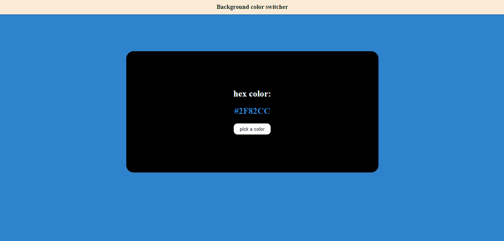

# Background color switcher

Simple project for generating hex colors and changing the body background by clicking a button

## Installation

- Download or clone the project
- Unzip/Install it

## How to use it?

- Open the index.html file in any browser
- Click on the 'generate a color' button

## Visual

## Hosted

try it here: https://k0ly0k0lev.github.io/background-color-switcher/
